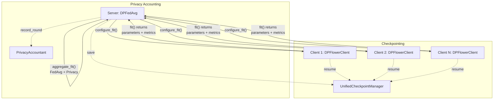

# API Reference

Welcome to the DP-FedMed API reference documentation. This section provides comprehensive documentation for all public APIs in the framework.

## Overview

DP-FedMed is built on three key frameworks:

- **Flower**: Federated learning orchestration
- **Opacus**: Differential privacy for PyTorch
- **MONAI**: Medical imaging models and transforms

The API is organized into the following modules:

## Core Modules

| Module | Purpose | Key Components |
|--------|---------|----------------|
| [**Client API**](client.md) | Client-side training with DP | `DPFlowerClient`, `client_fn()` |
| [**Server API**](server.md) | Federated aggregation strategy | `DPFedAvg`, `server_fn()` |
| [**Checkpoint API**](checkpoint.md) | State persistence & recovery | `UnifiedCheckpointManager`, `UnifiedCheckpoint` |
| [**Privacy API**](privacy.md) | Privacy budget accounting | `PrivacyAccountant`, `PrivacyMetrics` |
| [**Configuration API**](config.md) | Configuration management | `Config`, `load_config()` |

## Supporting Modules

| Module | Purpose | Key Components |
|--------|---------|----------------|
| [**Models API**](models.md) | Model creation utilities | `create_unet2d()`, parameter helpers |
| [**Data API**](data.md) | Dataset loading | `CellposeDataset` |
| [**Losses API**](losses.md) | Loss functions | `DiceLoss` |
| [**Tasks API**](tasks.md) | Training/evaluation loops | `train_one_epoch()`, `evaluate()` |

## Architecture Overview



## Quick Start

### Client-Side API

```python
from dp_fedmed.fl.client import DPFlowerClient

# Create a DP-enabled Flower client
client = DPFlowerClient(
    train_loader=train_loader,
    test_loader=test_loader,
    model_config={"in_channels": 1, "out_channels": 2},
    training_config={"local_epochs": 5, "learning_rate": 0.001},
    privacy_config={"style": "sample", "target_delta": 1e-5},
    device=device,
)

# Train locally with differential privacy
parameters, num_samples, metrics = client.fit(global_params, config)
```

### Server-Side API

```python
from dp_fedmed.fl.server import DPFedAvg

# Create privacy-aware aggregation strategy
strategy = DPFedAvg(
    target_delta=1e-5,
    noise_multiplier=1.0,
    num_rounds=10,
    fraction_fit=1.0,
)

# Aggregation handles privacy accounting automatically
aggregated_params, metrics = strategy.aggregate_fit(
    server_round=1,
    results=client_results,
    failures=[],
)
```

### Privacy Accounting API

```python
from dp_fedmed.privacy import PrivacyAccountant

# Track privacy budget across rounds
accountant = PrivacyAccountant(target_delta=1e-5)

# Record privacy metrics for each round
accountant.record_round(
    round_num=1,
    noise_multiplier_sample=1.0,
    sample_rate_sample=0.1,
    steps_sample=100,
    noise_multiplier_user=0.0,
    sample_rate_user=0.0,
    steps_user=0,
    num_samples=1000,
)

# Get cumulative privacy budget
epsilon = accountant.get_cumulative_sample_epsilon()
print(f"Privacy spent: ε = {epsilon:.4f}, δ = {accountant.target_delta}")
```

## Next Steps

- **For client development**: See [Client API](client.md)
- **For server development**: See [Server API](server.md) and [Privacy API](privacy.md)
- **For configuration**: See [Configuration API](config.md) and [Configuration Schema](../schemas/config.md)
- **For protocol details**: See [Communication Flow](../protocol/communication.md)
