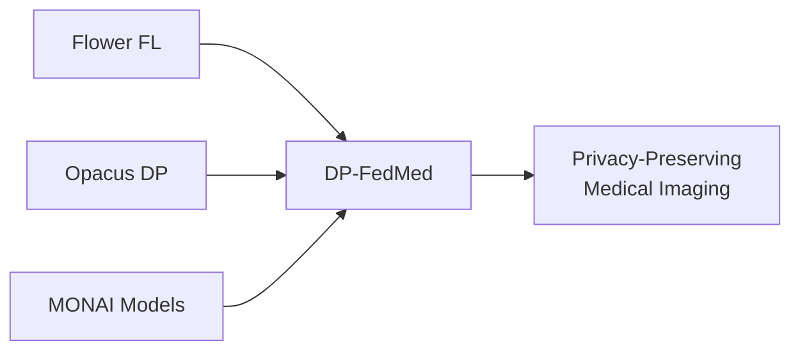
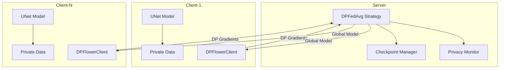

# DP-FedMed API Documentation

**Privacy-Preserving Federated Learning for Medical Imaging**

DP-FedMed is a comprehensive framework that combines state-of-the-art federated learning with formal differential privacy guarantees for medical image segmentation tasks.

## Overview

This framework integrates three powerful technologies:



- **[Flower](https://flower.ai/)**: Federated learning orchestration and client-server communication
- **[Opacus](https://opacus.ai/)**: Differential privacy engine for PyTorch models
- **[MONAI](https://monai.io/)**: Medical imaging deep learning library

## Key Features

### Privacy Guarantees
- **Central DP**: Privacy accounting at the server level with `(ε, δ)` guarantees
- **Local DP**: Client-side noise injection before transmission
- **Shuffle DP**: Privacy amplification through client sampling
- Real-time privacy budget tracking with automated stopping

### Production-Ready Components
- Unified checkpoint system with mid-round recovery
- Comprehensive configuration management via TOML files
- Automatic model state synchronization
- Privacy-aware aggregation strategies

### Medical Imaging Support
- U-Net 2D architecture optimized for segmentation
- Dice loss and evaluation metrics
- Integration with medical imaging datasets
- MONAI-compatible data loaders

## Installation

### Basic Installation

```bash
git clone https://github.com/aymuos15/SafeMedIA.git
cd dp_fl_unet
pip install -e .
```

### Documentation Dependencies

To build this documentation locally:

```bash
pip install -e ".[docs]"
```

## Quick Reference

### Configuration

All system behavior is controlled through TOML configuration files in `configs/`:

```toml
[privacy]
epsilon = 8.0
delta = 1e-5
max_grad_norm = 1.0
noise_multiplier = 1.1
```

See [Configuration Schema](schemas/config.md) for complete reference.

### Running Federated Training

**Server:**
```bash
python -m dp_fedmed.fl.server.app --config configs/user.toml
```

**Client:**
```bash
python -m dp_fedmed.fl.client.app --config configs/user.toml --client-id 0
```

## Architecture

### System Components



### Privacy Flow

1. **Client Training**: Local model training with Opacus privacy engine
2. **Gradient Clipping**: Per-sample gradient norm clipping
3. **Noise Injection**: Gaussian noise calibrated to privacy budget
4. **Secure Aggregation**: Server aggregates noisy updates
5. **Budget Tracking**: Real-time `(ε, δ)` accounting with automatic stopping

## Documentation Structure

### API Reference

Complete Python API documentation auto-generated from source code:

- [**Client API**](api/client.md) - `DPFlowerClient` and client factory functions
- [**Server API**](api/server.md) - `DPFedAvg` strategy and aggregation
- [**Privacy API**](api/privacy.md) - `PrivacyAccountant` and budget tracking
- [**Checkpoint API**](api/checkpoint.md) - `UnifiedCheckpointManager` for state persistence
- [**Configuration API**](api/config.md) - Config loading and validation
- [**Models API**](api/models.md) - UNet architecture creation
- [**Data API**](api/data.md) - Dataset loaders for medical imaging
- [**Losses API**](api/losses.md) - Segmentation loss functions
- [**Tasks API**](api/tasks.md) - Training and evaluation loops

### Schemas

Detailed specifications for configuration and data formats:

- [**Configuration Schema**](schemas/config.md) - Complete TOML configuration reference
- [**Message Schema**](schemas/messages.md) - Flower protocol message formats
- [**Checkpoint Schema**](schemas/checkpoint.md) - Checkpoint file structure

### Protocol Documentation

Internal protocols and workflows:

- [**Communication Protocol**](protocol/communication.md) - Round lifecycle and message flow
- [**Privacy Accounting**](protocol/privacy_accounting.md) - Budget tracking mechanisms

### Guides

Additional technical documentation:

- [**SSL/TLS Setup**](ssl.md) - Secure communication configuration
- [**Types of Differential Privacy**](types_of_dp.md) - Central, Local, and Shuffle DP

## Building This Documentation

### Local Development Server

Start a live-reloading development server:

```bash
mkdocs serve
```

Then open [http://127.0.0.1:8000](http://127.0.0.1:8000) in your browser.

### Static Site Generation

Build the documentation to static HTML:

```bash
mkdocs build
```

Output will be in the `site/` directory.

### Strict Mode

Build with strict checking for broken links:

```bash
mkdocs build --strict
```

## Project Information

- **Repository**: [github.com/aymuos15/SafeMedIA](https://github.com/aymuos15/SafeMedIA)
- **License**: Check repository for license information
- **Python**: 3.9+
- **Dependencies**: PyTorch, Flower, Opacus, MONAI

## Next Steps

- Review the [API Reference](api/index.md) for detailed class and function documentation
- Check [Configuration Schema](schemas/config.md) for all available settings
- Understand the [Communication Protocol](protocol/communication.md) for system internals
- Learn about [Privacy Accounting](protocol/privacy_accounting.md) for budget management
