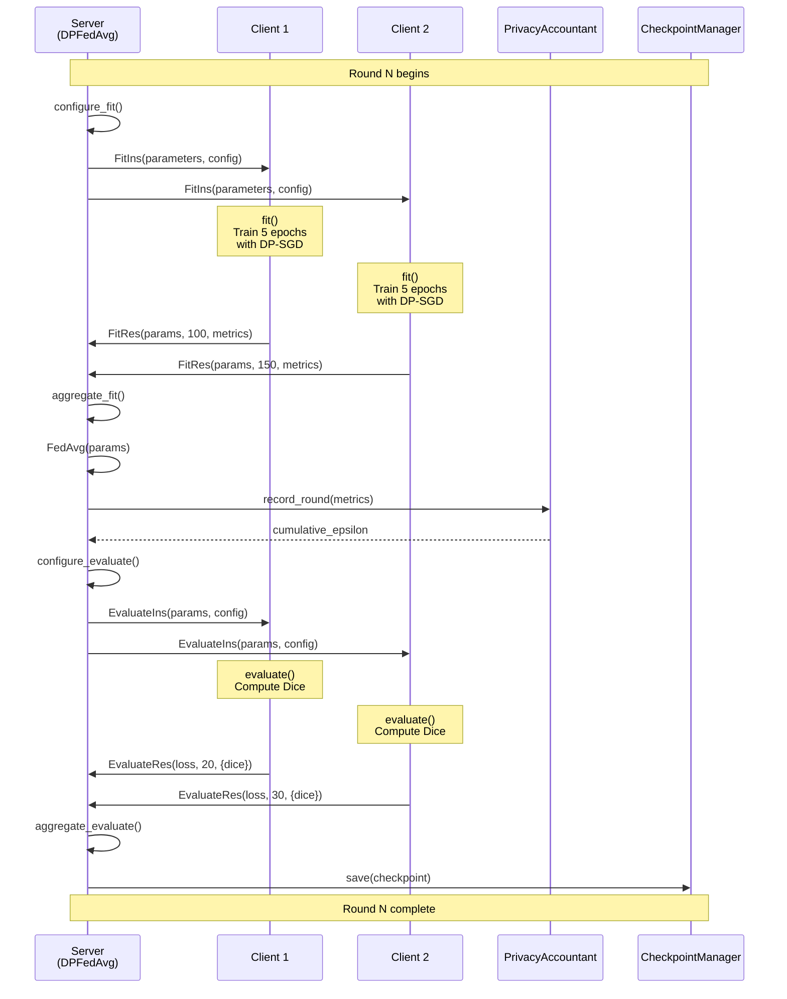
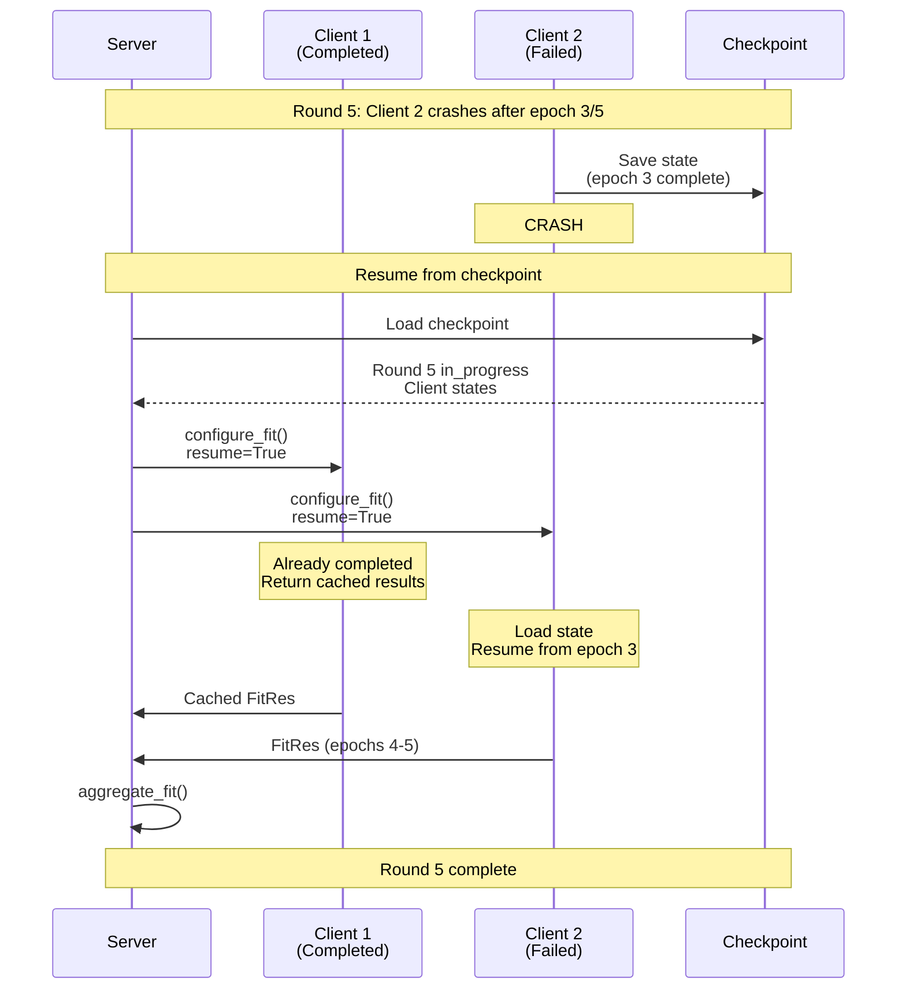

# Communication Flow

Detailed explanation of the Flower protocol communication flow in DP-FedMed.

## Overview

DP-FedMed uses Flower's gRPC-based federated learning protocol. Each training round consists of two phases:

1. **Training Phase**: Clients train locally on their data
2. **Evaluation Phase**: Clients evaluate the global model

## Round Lifecycle



## Phase 1: Training

### Step 1: Configure Fit

Server selects clients and prepares configuration.

**Server-side (`DPFedAvg.configure_fit`):**

```python
def configure_fit(self, server_round, parameters, client_manager):
    # Calculate actual round number
    actual_round = self.start_round + server_round - 1

    # Prepare config
    config = {
        "noise_multiplier": self.noise_multiplier,  # Pre-computed
        "server_round": actual_round,
        "local_epochs": self.local_epochs,
    }

    # Sample clients
    clients = client_manager.sample(
        num_clients=self.num_fit_clients,
        min_num_clients=self.min_fit_clients,
    )

    # Return instructions
    return [
        (client, FitIns(parameters, config))
        for client in clients
    ]
```

**Config sent to clients:**
- `noise_multiplier`: DP noise scale
- `server_round`: Round number for logging
- `local_epochs`: Number of local training epochs

### Step 2: Local Training

Clients train on local data with differential privacy.

**Client-side (`DPFlowerClient.fit`):**

```python
def fit(self, parameters, config):
    # Load global parameters
    set_parameters(self.model, parameters)

    # Setup DP if enabled
    if privacy_enabled:
        model, optimizer, train_loader = privacy_engine.make_private(
            module=self.model,
            optimizer=self.optimizer,
            data_loader=self.train_loader,
            noise_multiplier=config["noise_multiplier"],
            max_grad_norm=self.max_grad_norm,
        )

    # Train for local_epochs
    for epoch in range(config["local_epochs"]):
        epoch_loss = train_one_epoch(
            model, train_loader, optimizer, device
        )

    # Compute privacy spent
    epsilon = privacy_engine.get_epsilon(delta=target_delta)

    # Return results
    return (
        get_parameters(model),  # Updated parameters
        num_train_samples,      # Dataset size
        {
            "loss": avg_loss,
            "epsilon": epsilon,
            "sample_rate": sample_rate,
            "steps": num_steps,
        }
    )
```

**Training loop:**
1. Forward pass: predictions = model(images)
2. Compute loss
3. Backward pass with DP (Opacus handles clipping + noise)
4. Optimizer step
5. Repeat for all epochs

### Step 3: Aggregate Fit

Server aggregates client updates and tracks privacy.

**Server-side (`DPFedAvg.aggregate_fit`):**

```python
def aggregate_fit(self, server_round, results, failures):
    # Collect metrics
    epsilons = [res.metrics["epsilon"] for _, res in results]
    sample_rates = [res.metrics["sample_rate"] for _, res in results]
    steps = [res.metrics["steps"] for _, res in results]

    # Record privacy
    self.privacy_accountant.record_round(
        round_num=server_round,
        noise_multiplier_sample=self.noise_multiplier,
        sample_rate_sample=mean(sample_rates),
        steps_sample=mean(steps),
        # ... user-level params if applicable
    )

    # Aggregate parameters (FedAvg)
    aggregated_params = weighted_average([
        (res.parameters, res.num_examples)
        for _, res in results
    ])

    # Return aggregated results
    return aggregated_params, {
        "cumulative_sample_epsilon": self.privacy_accountant.get_cumulative_sample_epsilon(),
        # ... other metrics
    }
```

**Aggregation:**
- **FedAvg**: Weighted average by number of samples
- **Privacy**: RDP composition across clients
- **Checkpointing**: Store latest parameters

## Phase 2: Evaluation

### Step 4: Configure Evaluate

Server prepares evaluation round.

**Server-side (`DPFedAvg.configure_evaluate`):**

```python
def configure_evaluate(self, server_round, parameters, client_manager):
    config = {"server_round": server_round}

    clients = client_manager.sample(
        num_clients=self.num_evaluate_clients,
        min_num_clients=self.min_evaluate_clients,
    )

    return [
        (client, EvaluateIns(parameters, config))
        for client in clients
    ]
```

### Step 5: Local Evaluation

Clients evaluate global model on local test data.

**Client-side (`DPFlowerClient.evaluate`):**

```python
def evaluate(self, parameters, config):
    # Load parameters to evaluate
    set_parameters(self.model, parameters)

    # Evaluate (no gradients, no DP needed)
    metrics = evaluate(self.model, self.test_loader, self.device)

    return (
        metrics["loss"],
        num_test_samples,
        {"dice": metrics["dice"]}
    )
```

**Evaluation loop:**
1. Forward pass only (no backprop)
2. Compute predictions
3. Calculate Dice coefficient
4. Return metrics

### Step 6: Aggregate Evaluate

Server aggregates evaluation metrics and saves checkpoint.

**Server-side (`DPFedAvg.aggregate_evaluate`):**

```python
def aggregate_evaluate(self, server_round, results, failures):
    # Weighted average of Dice scores
    dice_scores = [res.metrics["dice"] for _, res in results]
    weights = [res.num_examples for _, res in results]
    avg_dice = sum(d * w for d, w in zip(dice_scores, weights)) / sum(weights)

    # Save checkpoint
    self.checkpoint_manager.update_server_state(
        parameters=self.latest_parameters,
        metrics={"dice": avg_dice},
        round_num=server_round,
    )
    self.checkpoint_manager.mark_round_completed(avg_dice)
    self.checkpoint_manager.save()

    return aggregated_loss, {"dice": avg_dice}
```

**Checkpointing:**
- **Last checkpoint**: Always saved
- **Best checkpoint**: Saved if Dice improved

## Mid-Round Recovery

When a crash occurs mid-round, the system can resume from the last saved state.



**Resume process:**

1. **Server loads checkpoint:**
   - Identifies round as "in_progress"
   - Loads client states

2. **Server signals resume:**
   - Sets `resume_from_checkpoint=True` in config
   - Provides checkpoint path

3. **Clients check state:**
   - If already completed: return cached results
   - If interrupted: load state and continue
   - If not started: start fresh

4. **Training continues:**
   - Interrupted client resumes from saved epoch
   - Completed clients skip training
   - All return to server

5. **Round completes normally:**
   - Server aggregates as usual
   - Checkpoint marked as completed

## Message Format Summary

### Training Messages

| Direction | Message | Content |
|-----------|---------|---------|
| Server → Client | FitIns | `(parameters, config)` |
| Client → Server | FitRes | `(parameters, num_examples, metrics)` |

### Evaluation Messages

| Direction | Message | Content |
|-----------|---------|---------|
| Server → Client | EvaluateIns | `(parameters, config)` |
| Client → Server | EvaluateRes | `(loss, num_examples, metrics)` |

## See Also

- [Message Schemas](../schemas/messages.md) - Complete message format reference
- [Client API](../api/client.md) - Client-side implementation
- [Server API](../api/server.md) - Server-side implementation
- [Checkpoint API](../api/checkpoint.md) - State persistence
- [Privacy Accounting](privacy_accounting.md) - Privacy budget tracking
