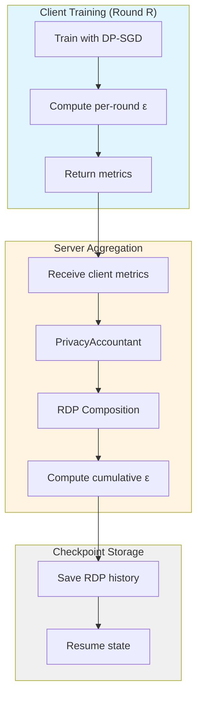
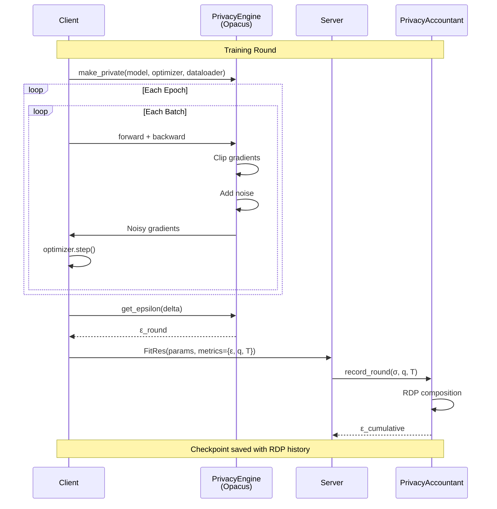

# Privacy Accounting Protocol

Detailed explanation of differential privacy budget tracking in DP-FedMed.

## Overview

DP-FedMed tracks privacy budget using **Renyi Differential Privacy (RDP)** for tight composition across multiple rounds of federated learning. The system supports:

- **Sample-level DP**: Privacy from local DP-SGD (Opacus)
- **User-level DP**: Privacy from client sampling (optional)
- **Hybrid DP**: Both sample and user-level combined

## Privacy Budget Flow



## Sample-Level Privacy

### Local DP-SGD (Opacus)

Each client applies differential privacy during local training.

**Per-batch process:**

1. **Forward pass**: Compute loss for each sample
2. **Per-sample gradients**: Opacus computes gradient for each sample separately
3. **Gradient clipping**: Clip each gradient to max_grad_norm
   ```
   g_i' = g_i / max(1, ||g_i|| / C)
   where C = max_grad_norm
   ```
4. **Noise addition**: Add Gaussian noise to aggregated gradients
   ```
   g_batch = (Σ g_i' + N(0, σ² C²)) / batch_size
   where σ = noise_multiplier
   ```
5. **Optimizer step**: Update model with noisy gradients

**Privacy cost per batch:**
- Computed using RDP at order α
- Depends on: noise_multiplier, sample_rate, steps
- Tracked by Opacus PrivacyEngine

**Per-round epsilon:**

After `local_epochs` of training:

```python
# Client computes epsilon for this round
epsilon_round = privacy_engine.get_epsilon(delta=target_delta)

# Includes all steps:
steps = len(train_loader) * local_epochs
```

### RDP Accountant

The `PrivacyAccountant` tracks cumulative privacy using RDP.

**Recording a round:**

```python
accountant.record_round(
    round_num=round_num,
    noise_multiplier_sample=1.0,     # σ
    sample_rate_sample=0.1,          # q (batch_size / dataset_size)
    steps_sample=100,                # T
    # ...
)
```

**RDP composition:**

For Gaussian mechanism with noise σ and sampling rate q:

```
RDP_α(M) = (α * q²) / (2 * σ²)
```

After T steps:

```
RDP_α(M^T) = T * RDP_α(M)
```

**Conversion to (ε, δ)-DP:**

```
ε = min_α { RDP_α + log(1/δ) / (α - 1) }
```

Opacus optimizes over α ∈ [2, 64] to find tightest bound.

## User-Level Privacy

### Client Sampling

Optional privacy from random client selection per round.

**Mechanism:**

1. **Sampling**: Select `k` out of `n` clients randomly
   - Sample rate: `q = k / n`

2. **Clipping** (optional): Clip each client's update
   ```
   Δ_i' = Δ_i / max(1, ||Δ_i|| / C_user)
   ```

3. **Noise**: Add Gaussian noise to aggregated update
   ```
   Δ_global = (Σ Δ_i' + N(0, σ_user² C_user²)) / k
   ```

4. **Apply**: Update global model

**Privacy cost:**

Tracked similarly to sample-level, but at user granularity:

```python
accountant.record_round(
    # ...
    noise_multiplier_user=0.5,       # σ_user
    sample_rate_user=0.8,            # k/n
    steps_user=1,                    # 1 step per round
)
```

## Hybrid Privacy

When both sample and user-level DP are enabled:

**Total privacy guarantee:**

```
ε_total = ε_sample + ε_user
```

This is a **conservative upper bound**. Tighter analysis possible but requires advanced composition.

**Use cases:**
- **ε_sample**: Protects individual data points
- **ε_user**: Protects client participation
- **Combined**: Protection against both threats

## Privacy Flow Diagram



## Privacy Parameters

### Sample-Level Parameters

| Parameter | Symbol | Typical Range | Effect |
|-----------|--------|---------------|--------|
| `noise_multiplier` | σ | 0.5 - 2.0 | Higher → more privacy, less utility |
| `max_grad_norm` | C | 0.1 - 5.0 | Lower → more privacy, may hurt convergence |
| `sample_rate` | q | Auto-computed | batch_size / dataset_size |
| `steps` | T | Auto-computed | len(dataloader) * local_epochs |

### User-Level Parameters

| Parameter | Symbol | Typical Range | Effect |
|-----------|--------|---------------|--------|
| `noise_multiplier_user` | σ_user | 0.1 - 1.0 | Higher → more privacy |
| `max_grad_norm_user` | C_user | 0.01 - 0.5 | Clip client updates |
| `sample_rate_user` | q_user | 0.5 - 1.0 | Fraction of clients |
| `steps_user` | T_user | 1 | Always 1 per round |

## Privacy Budget Over Rounds

**Example:** 10 rounds with σ=1.0, q=0.1, δ=1e-5

```
Round 1: ε = 0.85
Round 2: ε = 1.20  (cumulative)
Round 3: ε = 1.47
Round 4: ε = 1.70
Round 5: ε = 1.90
...
Round 10: ε = 2.68
```

**Key insight:** Privacy budget grows **sub-linearly** with RDP (√T behavior), much better than basic composition (T behavior).

## Checkpoint Integration

Privacy state is saved in checkpoints for exact resumption.

**Checkpoint privacy fields:**

```python
{
    "privacy": {
        "target_delta": 1e-5,
        "sample_history": [
            (1.0, 0.1, 100),  # (σ, q, T) for round 1
            (1.0, 0.1, 100),  # Round 2
            # ...
        ],
        "user_history": [
            (0.5, 0.8, 1),    # User-level for round 1
            # ...
        ],
        "cumulative_sample_epsilon": 2.5,
        "cumulative_user_epsilon": 0.3,
    }
}
```

**Resume workflow:**

1. Load checkpoint
2. Restore RDP history to accountant
3. Continue tracking from last state
4. Cumulative epsilon preserved exactly

## Privacy Budget Calculation

### Pre-Compute Noise Multiplier

For target epsilon εtarget:

```python
from dp_fedmed.privacy.budget_calculator import compute_noise_multiplier

noise_multiplier = compute_noise_multiplier(
    target_epsilon=8.0,
    target_delta=1e-5,
    sample_rate=0.1,
    steps_per_round=100,
    num_rounds=10,
)
# Returns: σ ≈ 1.0
```

**Note:** This is computed once before training starts.

### Monitor During Training

```python
# After each round
cumulative_eps = accountant.get_cumulative_sample_epsilon()
print(f"Round {r}: ε = {cumulative_eps:.2f} (target: {target_eps})")

if cumulative_eps > target_eps:
    print("WARNING: Privacy budget exceeded!")
    # Stop training or adjust parameters
```

## Privacy Styles

### Style: "none"

- **DP**: None
- **Privacy**: No guarantees
- **Use**: Baseline for comparison

### Style: "sample"

- **DP**: Sample-level only (Opacus)
- **Privacy**: (ε_sample, δ)-DP
- **Protects**: Individual data points
- **Use**: Most common setting

### Style: "user"

- **DP**: User-level only (server-side)
- **Privacy**: (ε_user, δ)-DP
- **Protects**: Client participation
- **Use**: When local DP not feasible

### Style: "hybrid"

- **DP**: Both sample and user-level
- **Privacy**: (ε_sample + ε_user, δ)-DP
- **Protects**: Both threats
- **Use**: Maximum privacy

## See Also

- [Privacy API](../api/privacy.md) - PrivacyAccountant implementation
- [Client API](../api/client.md) - Local DP-SGD training
- [Server API](../api/server.md) - Privacy tracking integration
- [Types of DP](../types_of_dp.md) - DP styles explained
- [Configuration Schema](../schemas/config.md) - Privacy parameters
