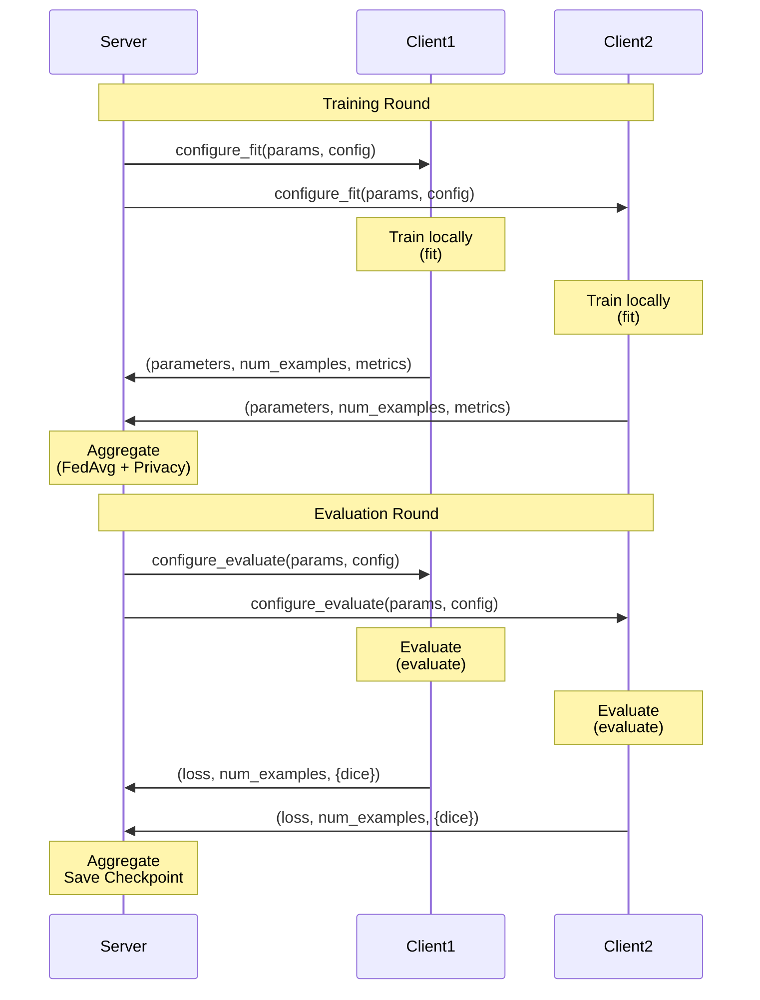

# Message Schemas

Reference for Flower protocol message formats used in client-server communication.

## Overview

DP-FedMed uses Flower's gRPC protocol for communication. Messages are exchanged as configuration dictionaries and metrics dictionaries containing scalar values (int, float, str, bool, bytes).

## Server → Client Messages

### configure_fit() Config

Sent from server to clients at the start of each training round.

| Key | Type | Required | Description |
|-----|------|----------|-------------|
| `noise_multiplier` | float | Yes | Pre-computed noise multiplier for DP-SGD |
| `server_round` | int | Yes | Current round number (1-indexed) |
| `local_epochs` | int | Yes | Number of local training epochs |
| `resume_from_checkpoint` | bool | No | Whether to resume from saved state |
| `checkpoint_path` | str | Conditional | Path to checkpoint file (required if resuming) |

**Example:**
```python
{
    "noise_multiplier": 1.0,
    "server_round": 5,
    "local_epochs": 5,
    "resume_from_checkpoint": False,
}
```

**Mid-Round Resume Example:**
```python
{
    "noise_multiplier": 1.0,
    "server_round": 3,
    "local_epochs": 5,
    "resume_from_checkpoint": True,
    "checkpoint_path": "/path/to/checkpoints/last.pt",
}
```

### configure_evaluate() Config

Sent from server to clients at the start of evaluation.

| Key | Type | Required | Description |
|-----|------|----------|-------------|
| `server_round` | int | Yes | Current round number |

**Example:**
```python
{
    "server_round": 5,
}
```

## Client → Server Messages

### fit() Return Metrics

Returned from clients to server after training.

| Key | Type | Description |
|-----|------|-------------|
| `loss` | float | Average training loss across all local epochs |
| `epsilon` | float | Privacy budget (ε) spent in this round |
| `delta` | float | Privacy parameter δ (from target_delta config) |
| `sample_rate` | float | Batch sampling rate for DP-SGD |
| `steps` | int | Number of DP-SGD steps performed |

**Also returned (not in metrics dict):**
- `parameters`: Updated model parameters as NDArrays
- `num_examples`: Number of training samples

**Example:**
```python
# Client returns:
(
    parameters,  # List[np.ndarray]
    1000,        # num_examples
    {
        "loss": 0.245,
        "epsilon": 0.85,
        "delta": 1e-5,
        "sample_rate": 0.1,
        "steps": 100,
    }
)
```

### evaluate() Return Metrics

Returned from clients to server after evaluation.

| Key | Type | Description |
|-----|------|-------------|
| `dice` | float | Dice coefficient score on local test data |

**Also returned (not in metrics dict):**
- `loss`: Average evaluation loss
- `num_examples`: Number of test samples

**Example:**
```python
# Client returns:
(
    0.235,  # loss
    200,    # num_examples
    {
        "dice": 0.87,
    }
)
```

## Server Aggregated Metrics

### aggregate_fit() Return Metrics

Returned by server strategy after aggregating client training results.

| Key | Type | Description |
|-----|------|----------|
| `round_sample_epsilon` | float | Average sample-level epsilon for this round |
| `cumulative_sample_epsilon` | float | Total sample-level epsilon across all rounds |
| `cumulative_user_epsilon` | float | Total user-level epsilon across all rounds |

**Also returned:**
- `parameters`: Aggregated global model parameters

**Example:**
```python
# Strategy returns:
(
    aggregated_parameters,  # Parameters
    {
        "round_sample_epsilon": 0.85,
        "cumulative_sample_epsilon": 4.2,
        "cumulative_user_epsilon": 0.0,
    }
)
```

### aggregate_evaluate() Return Metrics

Returned by server strategy after aggregating client evaluation results.

| Key | Type | Description |
|-----|------|-------------|
| `dice` | float | Weighted average Dice score across clients |

**Also returned:**
- `loss`: Weighted average evaluation loss

**Example:**
```python
# Strategy returns:
(
    0.215,  # aggregated_loss
    {
        "dice": 0.87,
    }
)
```

## Message Flow Diagram



## Type Definitions

### Flower Types

```python
from flwr.common import Scalar, NDArrays

# Scalar: Union of primitive types
Scalar = Union[int, float, str, bytes, bool]

# NDArrays: List of NumPy arrays
NDArrays = List[np.ndarray]

# Config: Dictionary of scalars
Config = Dict[str, Scalar]

# Metrics: Dictionary of scalars
Metrics = Dict[str, Scalar]
```

### Return Tuples

```python
# fit() return type
FitRes = Tuple[NDArrays, int, Metrics]
# (parameters, num_examples, metrics)

# evaluate() return type
EvaluateRes = Tuple[float, int, Metrics]
# (loss, num_examples, metrics)

# aggregate_fit() return type
AggregateRes = Tuple[Optional[Parameters], Metrics]
# (parameters, aggregated_metrics)

# aggregate_evaluate() return type
AggregateEvalRes = Tuple[Optional[float], Metrics]
# (loss, aggregated_metrics)
```

## Privacy Metrics Flow

Privacy metrics flow from clients to server for accounting:

1. **Client Training:**
   - Opacus computes per-round epsilon
   - Client returns epsilon, sample_rate, steps in metrics

2. **Server Aggregation:**
   - Server collects epsilon from all clients
   - PrivacyAccountant records round with RDP composition
   - Server returns cumulative epsilon in aggregated metrics

3. **Checkpoint:**
   - Privacy state saved in checkpoint
   - Includes RDP history for exact resumption

See [Privacy Accounting Protocol](../protocol/privacy_accounting.md) for details.

## See Also

- [Client API](../api/client.md) - Client-side message handling
- [Server API](../api/server.md) - Server-side aggregation
- [Communication Flow](../protocol/communication.md) - Complete round lifecycle
- [Privacy API](../api/privacy.md) - Privacy metrics tracking
